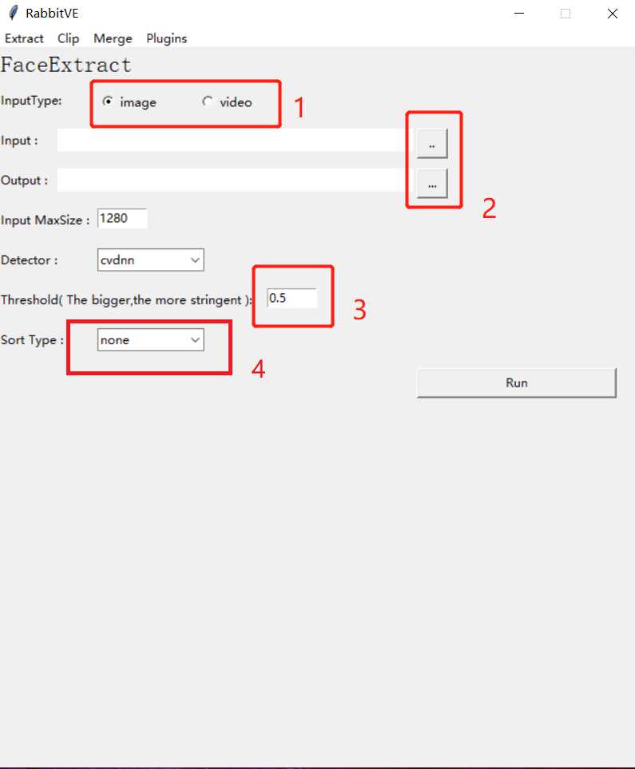
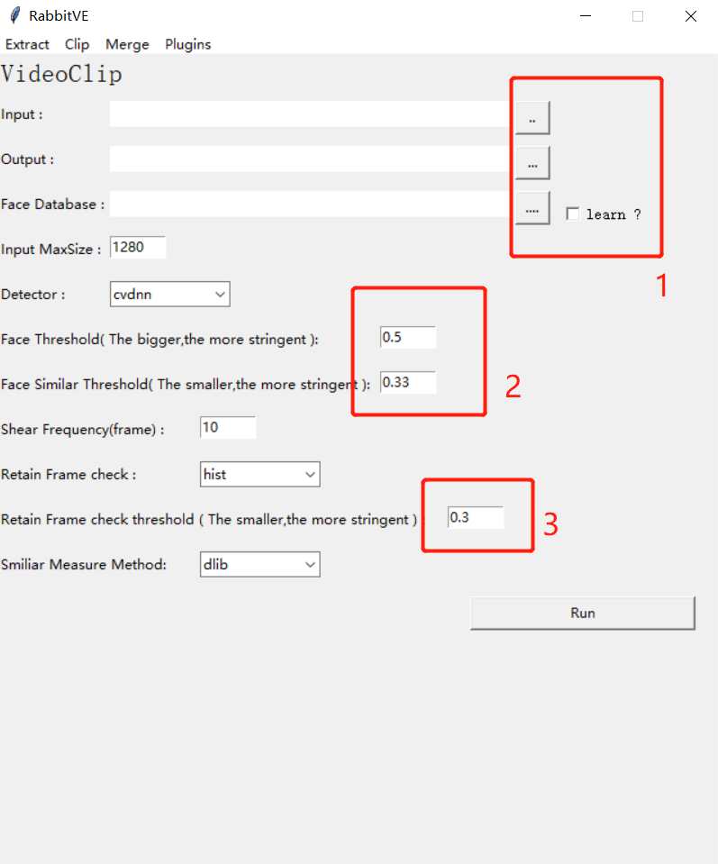
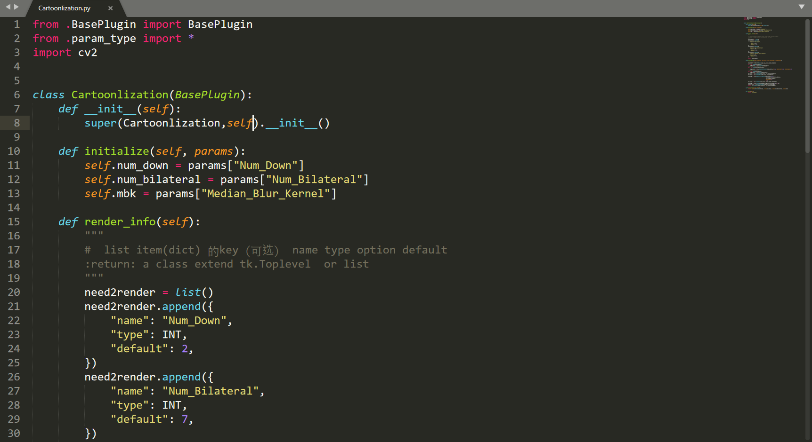
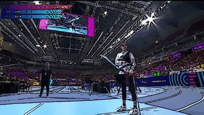

# RabbitVE  :rabbit2:
 [](https://996.icu/#/en_US)
=======


## English Description:


> RabbitVE ,rabbit video edit, which is a open video edit software using AI.
>
> For now ,rabbitVE support video clip for special person to make a personal video clip,which usually  be an  importance part of fans activities  in China.
>
> There is a demo about ChaoYue Yang,who is a idol of China. From *`Super Start Games`*, a two-hour TV program,rabbitVE cut a 16 minute fragment of ChaoYue Yang.
>
> You can see the demo in  this link. [bilibili](https://www.bilibili.com/video/av53132715) 
>
> In the future,I intent to add some new feature for the software.For example, ban the person ,who you don't want to see ,in the video , like [this](https://github.com/minimaxir/person-blocker) ,clean this  people using Image-Inpainting like [this](https://github.com/MathiasGruber/PConv-Keras),or some image translation based GAN.
>
> But there is still a long way to go.
>
> Thank for you watching and  giving me a start.


----

## 中文版

### :rainbow:背景

rabbitVE是一个意图使用AI技术进行视频编辑的软件，目前还在初级阶段。在参考[这篇知乎文章](https://zhuanlan.zhihu.com/p/66248591)后获得的灵感，因此第一个实现的技术也是基于face location 和face recognition以及一系列修正算法做出的视频单人剪辑。但很遗憾的一点是，虽然在原作者的实现上做出了一点改进:muscle:,​ 但仍然没法做到全自动，需要一定的人工干预，**只能起到辅助作用。** :sweat:


### :yum:News

| Data      | Update                                                  |
| :-------- | ------------------------------------------------------- |
| 2019.5.24 | 增加插件机制，自动绘制GUI，及提供卡通化插件，使用说明等 |
| 2019.5.23 | 增加GUI界面及改变代码结构                               |
| 2019.5.21 | 第一次提交                                              |


### :sparkling_heart:使用说明

普通用户不建议修改红框外的默认参数。

- 脸部抽取，建立人脸数据库（需要人工对抽取结果进行选择保留）

  

  用户需要在 1中**先**勾选输入时图片还是视频（否则无法进行2），然后点击2，分别选择输入图片/视频（可多选），然后选择目录存放识别结果。3是确认检测的物体是否为人脸的阈值，取值是（0-1），越大越严格。

  4是是否对识别的图片进行相似度排序，方便人工选择。默认为none，不排序。其余为排序的方式。建议选择hist进行排序。
  最后点击run，就可以去喝咖啡了。
  
- 视频智能分割（需要人工对剪辑视频结果进行排除）

  

  1为文件输入输出设定，其中注意的是，**Face Database**是目标人脸存储的地方，即上一步的抽取目录。其中如果勾选learn，程序会对Face Databse的数据进行学习，并保存学习结果（覆盖式保存，需要的话请保存副本）。如果已经学习了一次，且Face Database没有变更，即不需要勾选。如果你需要的是杨超越的数据，在model文件下也已经提供了一个，并不需要再学习。

  2为两个阈值。第一个为脸部识别的阈值和上一步的意义一样。第二个阈值为区分检测的脸是否和Face Database的脸部相似的阈值。越低越严格。

  3为了修正人脸检测算法会因为角度，遮挡等无法检测人脸，算法会通过一定方式判断检测不到人脸的帧是否和前面检测到人脸的帧连续，低于该阈值则判断为连续，当使用不同的判断方法来，该阈值有不同的效果。默认使用直方图来计算（ histogram）。

  最后点击run，又可以去喝咖啡了。

- 分割视频进行合并


通过1来选择需要合拼的视频的目录，即上一步的Output Dir，合拼的视频需要有共同的前缀和共同后缀。通过2来选择合拼视频的格式。

- 开发自己的插件
- 

rabbitVE支持用户开发自己的插件。通过2来选定插件，然后点击Load载入。插件需要提供```initialize```，```render_info```,```transform```接口，rabbitVE会通过```render_info```来字段绘制简易的GUI（上图右窗口），在插件运行读取每一帧并调用```transform```，用户需要在```transform```完成图片的转换和处理。下面以OpenCV自带的工具实现图像卡通化，为例，简述如何实现一个插件。未来会提供智能马赛克等手段，也会通过此机制实现。



插件的运行机制是：载入插件---> 通过```__import__```导入python对象并实例化 ---- >根据```render_info```绘制GUI --- > 填写参数，运行插件 ----> 通过```transform```接口修改每一帧，保存处理后的视频。

### :star2:Demo：

- 剪辑视频

  视频： [bilibili](https://www.bilibili.com/video/av53132715)  《超新星全运会》 2018.11.11期 杨超越单人cut

  原视频：《超新星全运会》 2018.11.11期

- 卡通化插件效果

  
  
  

### :couple:运行环境

- python 3.5+
- opencv 3.3+
- dlib
- sklearn-image (skimage)
- ffmpeg
- <del>moviepy</del>
- window 10，8G+  Memory（其余环境未经测试）


### :floppy_disk:文件介绍(script)

- tool_clip.py 从视频上直接剪辑与face database相关人物的帧。
- tool_extract.py 可以从视频或图片集上剪裁人脸，并输出在指定的目录里（face database）
- tool_sort.py 对剪裁出来的人脸根据某一相似度量方法排序并输出，方便用于在剪裁后的人脸进行人工去重或剔除无关样本。
- tool_merge.py 对从视频上剪辑出来的片段按顺序合成。

目前不同功能以单个脚本的形式存在，迟点会整合和各功能插件化，至于GUI会视项目发展情况来决定是否添加。

### :runner:未来

首先一点，对于更好，更快的人脸模型是刚需，会定期考虑整合前沿相关技术。

其次一点是会考虑引入一个逐帧进行处理的技术，这样可以配合相关的语义分割/实例分割技术，进行对指定的样本的[智能打码](https://github.com/minimaxir/person-blocker)，使用图像补全的技术进行[智能清除该对象](https://github.com/MathiasGruber/PConv-Keras)，或这使用各种基于GAN的技术等。:collision:

总而言之，能搞的东西很多，欢迎关注和PR。 :star::star2::star2:

### Lincense

GPL 3.0
